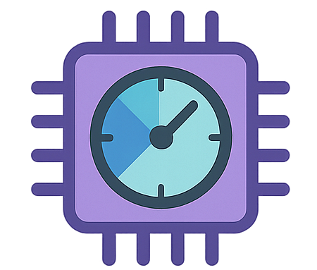
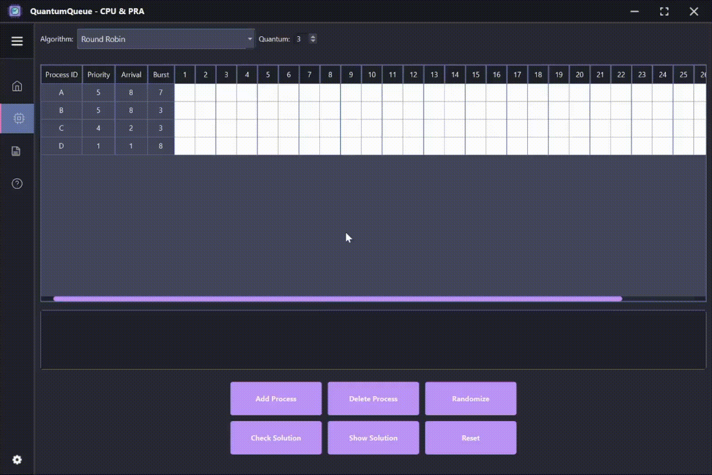
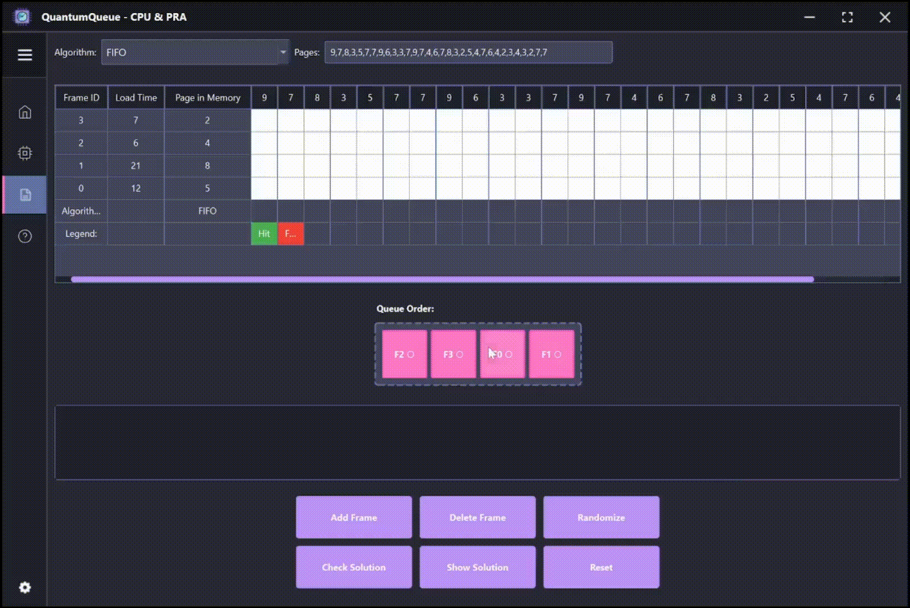
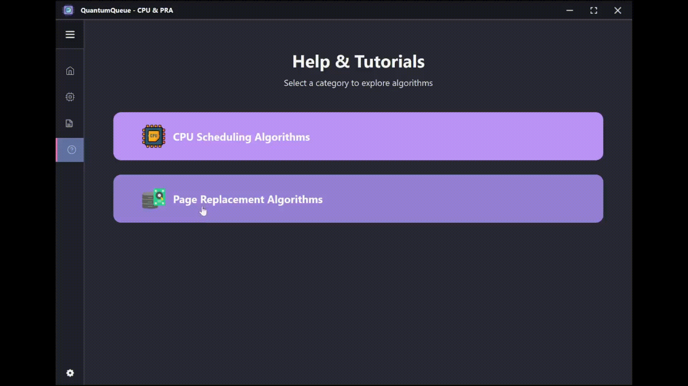

# QuantumQueue

<p align="center">
  
</p>

<p align="center">
  <strong>Interactive learning tool for CPU Scheduling and Page Replacement Algorithms</strong>
</p>

<p align="center">
  <a href="#-quick-start">Quick Start</a> •
  <a href="#-features">Features</a> •
  <a href="#-showcase">Showcase</a> •
  <a href="#-usage">Usage</a> •
  <a href="#-tutorials">Tutorials</a>
</p>

---

## About

QuantumQueue is a comprehensive educational tool designed to help students learn and practice CPU Scheduling and Page Replacement Algorithms. With an intuitive interface, step-by-step tutorials, and real-time visualizations, mastering these core operating system concepts has never been easier.

- **Practice Mode**: Test your understanding with randomized problems
- **Solution Checking**: Verify your answers against correct solutions
- **Visual Feedback**: See colorful Gantt charts and queue visualizations
- **Calculated Metrics**: TAT, WT, responsiveness, hit ratios, and more

---

## Quick Start

### Download & Run (Recommended)

| Platform | Download | Instructions |
|----------|----------|--------------|
| **Windows** | [📥 Download EXE](https://github.com/dianbrown/CPU-SchedulingApp/releases/latest) | Run `QuantumQueue-Setup.exe` and follow the installer |
| **macOS** | [📥 Download DMG](https://github.com/dianbrown/CPU-SchedulingApp/releases/latest) | Open DMG, drag to Applications folder |
| **Portable** | [📥 Download ZIP](https://github.com/dianbrown/CPU-SchedulingApp/releases/latest) | Extract and run `QuantumQueue.exe` directly |


### Run from Source

```bash
# Clone the repository
git clone https://github.com/dianbrown/CPU-SchedulingApp.git
cd CPU-SchedulingApp

# Install dependencies
pip install -r requirements.txt

# Run the application
python main.py
```

---

## Features

### CPU Scheduling Algorithms

| Algorithm | Type | Description |
|-----------|------|-------------|
| **FCFS** | Non-preemptive | First Come First Served - Basic FIFO scheduling |
| **FCFS Priority** | Preemptive | Priority-based with FCFS tie-breaking |
| **SJF** | Non-preemptive | Shortest Job First - Optimal for average wait time |
| **SJF Priority** | Preemptive | Priority-based with shortest job tie-breaking |
| **SRT** | Preemptive | Shortest Remaining Time - Preemptive SJF |
| **Round Robin** | Preemptive | Time-quantum based fair scheduling |
| **RR Priority** | Preemptive | Priority + time quantum scheduling |

### Page Replacement Algorithms

| Algorithm | Description |
|-----------|-------------|
| **FIFO** | First In First Out - Queue-based replacement |
| **LRU** | Least Recently Used - Recency-based replacement |
| **Optimal** | Farthest future use - Theoretical best |
| **Second Chance** | Enhanced FIFO with R-bit second chances |
| **Clock** | Circular buffer with R-bit sweep |

### Application Features

- 🎨 **28 Beautiful Themes** — Dracula, Nord, Tokyo Night, Solarized, and more
- 📊 **Visual Gantt Charts** — Interactive timeline visualization
- 🎯 **Step-by-Step Tutorials** — Learn every algorithm with examples
- 🔄 **Random Problem Generation** — Endless practice opportunities
- 📝 **Editable Tables** — Customize processes and frames
- 📈 **Real-time Metrics** — WT, TAT, hit ratios, fault counts
- 🎭 **Drag-and-Drop** — Interactive queue reordering for PRA
- 💾 **Persistent Settings** — Your preferences saved across sessions
- ♿ **Colorblind Accessible** — Configurable hit/fault colors

---

## Showcase

### CPU Scheduling

<!-- Add your CPU scheduling demo GIF here -->
<p align="center">
  <em>🎥 CPU Scheduling Demo GIF coming soon...</em>
  <!--  -->
</p>

### Page Replacement Algorithms

<!-- Add your PRA demo GIF here -->
<p align="center">
  <em>🎥 Page Replacement Demo GIF coming soon...</em>
  <!--  -->
</p>

### Interactive Tutorials

<!-- Add your tutorial demo GIF here -->
<p align="center">
  <em>🎥 Tutorial Demo GIF coming soon...</em>
  <!--  -->
</p>

### Theme Showcase

<!-- Add your theme switching GIF here -->
<p align="center">
  <em>🎥 Theme Showcase GIF coming soon...</em>
  <!--  -->
</p>

---

## Usage

### CPU Scheduling Practice

1. **Select Algorithm** — Choose from the dropdown (FCFS, SJF, Round Robin, etc.)
2. **Generate Problem** — Click "Randomize" or enter your own processes
3. **Fill Timeline** — Click cells to schedule processes:
   - `Single Click` — Fill one time slot
   - `Double Click` — Auto-fill entire burst time
   - `Right-Click` — Add RS (Ready State) markers
4. **Check Solution** — Verify your answer against the correct solution
5. **View Metrics** — See WT, TAT, and responsiveness per process

### Page Replacement Practice

1. **Select Algorithm** — Choose FIFO, LRU, Optimal, Second Chance, or Clock
2. **Set Up Frames** — Configure frame count and initial pages
3. **Enter Page Sequence** — Type pages or use "Randomize"
4. **Arrange Queue** — Drag-and-drop frames to set initial order
5. **Solve & Check** — Mark hits/faults and verify your solution

---

## Tutorials

Access step-by-step tutorials from the **Help screen**:

1. Click the **Help icon** (❓) in the sidebar
2. Choose **CPU Scheduling** or **Page Replacement**
3. Select any algorithm card
4. Click **"View Example"** for an interactive walkthrough

Each tutorial includes:
- Algorithm rules and edge cases
- Randomizable practice problems
- Step-by-step explanations
- Visual queue/table updates

### Algorithm Reference

Additionally, the [Algorithm Rules](AlgorithmRules.md) document provides a detailed explanation of each algorithm's logic. Combined with the provided Python classes i created for each algorithm, it offers a comprehensive resource for understanding the implementation and applying it to your own code or programs.

---

## Project Structure

```
QuantumQueue/
├── main.py                 # Application entry point
├── requirements.txt        # Python dependencies
├── algorithms/             # CPU scheduling algorithms
├── PRA/                    # Page replacement algorithms
│   ├── algorithms/         # FIFO, LRU, Optimal, etc.
│   ├── models/             # Frame data models
│   └── ui/                 # PRA interface
├── pages/                  # UI pages and tutorials
├── themes/                 # Theme JSON files
├── tutorial_kb/            # Tutorial step definitions
├── Assets/                 # Icons and resources
└── utils/                  # Helper utilities
```

---

## Contributing

Contributions are welcome! Feel free to:
- Report bugs or issues
- Suggest new features
- Submit pull requests

---

## License

This project is open source and available for educational purposes.

---

<p align="center">
  Made with ❤️ for students learning Operating Systems
</p>
